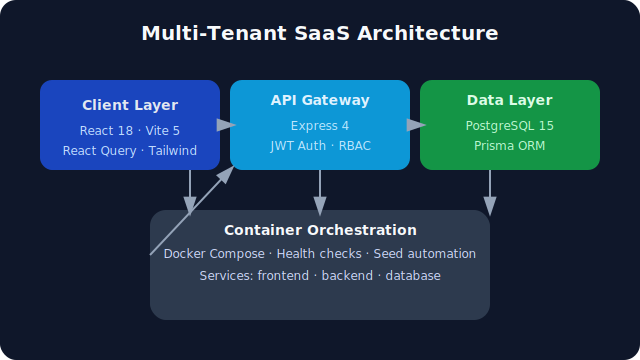

# Multi-Tenant SaaS Control Center

Multi-Tenant SaaS Control Center is a reference implementation of a tenant-aware project, task, and user management platform. It targets operations teams at SMB/enterprise organizations who need to stand up isolated workspaces quickly while enforcing usage caps, audit logs, and role-based permissions. The project ships with full-stack code, documentation, and Docker automation suitable for evaluation or further customization.

## Features
- Tenant onboarding flow with automated subscription limits, audit logging, and seeded demo data.
- JWT authentication + role-based authorization (`super_admin`, `tenant_admin`, `user`)
- Dashboard with KPI tiles, project summaries, and task completion charting.
- Project CRUD with in-app task creation, filtering, and progress tracking.
- Task board with cross-project view, inline status changes, and assignment controls.
- User management (invite, role changes, activation toggles) wired to tenant quotas.
- Comprehensive audit logging across auth, tenant, project, and task actions.
- Dockerized local environment (frontend, backend, Postgres) with automatic migrations + seeding.

## Technology Stack
| Layer | Technology | Version / Notes |
| --- | --- | --- |
| Frontend | React 18.3.1, Vite 5.4.10, React Router 7.0.2, React Query 5.62.6, React Hook Form 7.53, Zod 3.23, Tailwind utility classes | Modern SPA experience |
| Backend | Node.js 20, Express 4.18.2, TypeScript 5.3.3, ts-node-dev 2.0.0, Helmet, CORS, Morgan | REST API + auth |
| ORM & DB | Prisma 5.9.1, PostgreSQL 15 | Relational tenant isolation |
| Auth | JSON Web Tokens (JWT) with bcrypt password hashing | Stateless sessions |
| Containerization | Docker Desktop / Compose v2 | One-command startup |
| Tooling | ESLint, Vitest-ready setup (tests TBD) | Dev experience |

## Architecture Overview
The system is organized into a client layer (React SPA), an API gateway (Express + Prisma), and a Postgres-backed data layer. Docker Compose orchestrates the three services (frontend, backend, database), ensuring migrations and seeds run automatically before the backend reports healthy status. Requests flow through the frontend to the backend REST API, which enforces tenant context and role-based permissions before hitting the database. Observability is provided via audit logs and health checks.



## Installation & Setup
### Prerequisites
- Node.js 20.x and npm 10+
- PostgreSQL 15 (local) or Docker Desktop (for containerized setup)
- Git

### Local Development (without Docker)
1. **Clone & install**
   ```bash
   git clone <repo>
   cd multi-tenant-saas
   cd backend && npm install
   cd ../frontend && npm install
   ```
2. **Environment variables**: copy `backend/.env.example` to `backend/.env` and adjust values (see [Environment Variables](#environment-variables)).
3. **Database**: ensure Postgres is running; create database `saas_db` and update credentials in `.env`.
4. **Migrations**:
   ```bash
   cd backend
   npm run migrate:dev
   ```
5. **Seed data**:
   ```bash
   npm run seed
   ```
6. **Start backend API**:
   ```bash
   npm run dev
   ```
7. **Start frontend app** (new terminal):
   ```bash
   cd frontend
   npm run dev
   ```
   Visit `http://localhost:5173` (or configured port) to sign in with the creds listed in `submission.json`.

### Docker Workflow (recommended for evaluation)
1. Rename/copy env files if needed (Docker uses the provided defaults).
2. From the repo root run:
   ```bash
   docker compose up -d --build
   ```
3. Wait for all services to report `Up` via `docker compose ps`. Health endpoint: `curl http://localhost:5000/api/health` should return `{ "status": "ok", "database": "connected" }`.
4. Access the app at `http://localhost:3000` and sign in with the seeded credentials (`superadmin@system.com` / `Admin@123`, or tenant accounts from `submission.json`).
5. To tear down: `docker compose down -v`.

## Environment Variables
| Variable | Description |
| --- | --- |
| `NODE_ENV` | Runtime environment (`development`, `production`). Controls logging + CORS defaults. |
| `PORT` | Backend port (defaults to `5000`). |
| `DB_HOST`, `DB_PORT`, `DB_NAME`, `DB_USER`, `DB_PASSWORD` | Individual Postgres connection parameters. |
| `DATABASE_URL` | Full Prisma connection string. Required for migrations/seeds. |
| `JWT_SECRET` | 32+ character signing key for JWT tokens. |
| `JWT_EXPIRES_IN` | JWT expiration window (e.g., `24h`). |
| `FRONTEND_URL` | Comma-separated list of allowed origins for CORS (local: `http://localhost:3000,http://localhost:5173`; Docker: include `http://frontend:3000`). |
| `EMAIL_HOST`, `EMAIL_PORT`, `EMAIL_USER`, `EMAIL_PASSWORD` | Optional SMTP provider settings for future email integrations. Currently unused but documented for evaluation completeness. |

> Frontend-specific settings: during Docker builds we pass `VITE_API_URL` (defaults to `http://localhost:5000/api`). For local dev, update `frontend/.env` or `vite.config.js` if you need a different API base.

## API Documentation
Full request/response specs for every REST endpoint (auth, tenants, users, projects, tasks) are published in [`docs/API.md`](./docs/API.md). Highlights:
- 20+ endpoints grouped by domain (Auth, Tenants, Users, Projects, Tasks).
- Each entry lists HTTP method, path, auth requirements, request schema, and example responses.
- Authentication section explains JWT usage and tenant scoping.

## Additional Notes
- Seeded credentials and evaluation metadata live in `submission.json`.
- Docker images automatically call `prisma migrate deploy` and `prisma db seed` before launching the API, ensuring test logins always work.
- For troubleshooting dockerized runs, inspect logs via `docker compose logs backend` or `docker compose logs frontend`.
